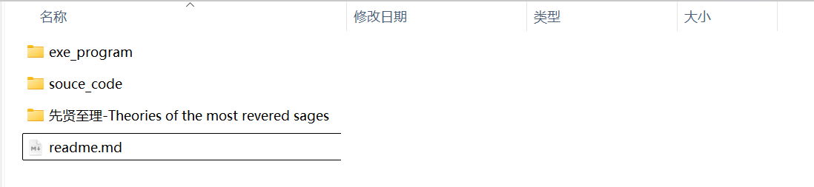
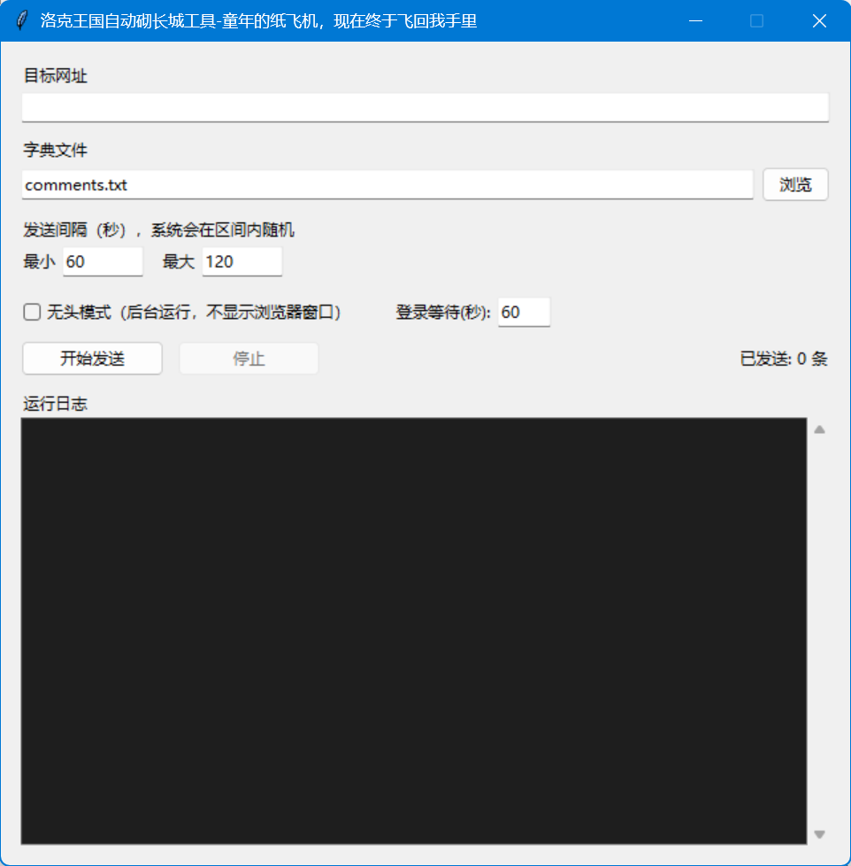

# 小红薯砌长城工具

## 说明

本工具专为小红书PC网页端量身打造，主要适用于个人账号的内容运营与互动测试。它支持在后台静默运行，能够按照预设的时间策略，自动分发本地字典中的友好评论，帮助创作者在无需人工死守的情况下，高效维护评论区的日常互动生态。

需要特别强调的是，该项目纯仅限用于个人帖子测试、技术交流与学术研究。**作为开发者，我坚定提倡性别平等，极力反对任何形式的性别对立、网络暴力及不友善行为**。因此，请使用者务必保持技术中立与善意初衷，切莫将其用于商业恶意刷量，更不得利用该工具篡改字典去挑动网民情绪或制造群体撕裂。由于平台风控规则具有动态性，任何因不当使用、违规操作或恶意引导舆论而导致的账号受限、法律纠纷及其他相关后果，均由使用者本人承担全部责任，本人作为技术爱好者概不负责。

**~~尤其不要听一些串子说的：行行行赶紧来炸女厕吧~~**

## 技术概况

程序技术其实非常简单。没什么门槛。一般程序员都可以基于此魔改。欢迎大家发布更好的相关工具，维护良好文娱环境，共同爱男。

### 1. 核心技术栈

- **自动化引擎（Selenium WebDriver）：** 负责驱动真实的 Chrome 浏览器，模拟人类用户的点击、输入和提交操作，直接在浏览器端执行行为。
- **界面开发（Tkinter & ttk）：** 使用 Python 原生的 GUI 库构建桌面客户端，包含输入框、复选框、日志监控区（Text 组件），并进行了深色系（Dark Mode）的日志区样式美化。
- **多线程并发（Threading）：** 采用**典型的“UI线程 + 工作线程”异步架构**。将浏览器自动化（Selenium 循环）放在子线程（`daemon=True`）中运行，确保自动化执行时 GUI 界面不会陷入“未响应”假死状态。

### 2. 反爬虫与反自动化绕过（Anti-Bot Bypass）

代码在 `init_driver` 函数中集成了非常经典的**反爬初级绕过策略**：

- **规避特征：** 通过 `--disable-blink-features=AutomationControlled` 和 `excludeSwitches` 移除 Selenium 默认的自动化特征标识。
- **动态注入：** 在页面加载前执行 JavaScript，将 `navigator.webdriver` 重新定义为 `undefined`，防止目标网站通过前端 JS 检测到这是由自动化工具控制的浏览器。

### 3.DOM 交互与事件触发机制

在 `send_comment` 核心逻辑中，代码没有使用常规的 `element.send_keys()`，而是采用了更底层的**原生 JS 注入机制**：

- **文本填入：** 通过 `arguments[0].textContent = arguments[1]` 直接修改编辑器的文本节点。
- **事件分发（关键）：** 连续触发了 `input`、`change`、`keyup` 三个**冒泡事件（Bubbles）**。这是为了瞒过诸如 React、Vue 或 Angular 等现代前端框架的虚拟 DOM（Virtual DOM）监听机制，确保页面组件能够捕获到文本变化，进而激活原本处于禁用状态（`disabled`）的发布按钮。

### 4.健壮性与容错机制（Robustness）

- **显式等待（Explicit Waits）：** 引入 `WebDriverWait` 配合 `expected_conditions`，动态等待输入框出现和按钮可点击，避免因网络波动或页面加载延迟导致的元素找不到（`NoSuchElementException`）错误。
- **异常捕获与页面自愈：** 针对动态网页中极易发生的 `StaleElementReferenceException`（元素引用失效）进行了捕获，并在发生未知错误时通过 `driver.refresh()` 刷新页面并休眠 8 秒，实现了简单的“脚本自愈”。
- **随机延时：** 允许用户设置时间区间，利用 `random.randint` 生成随机等待秒数，使发布频率具有拟人性，降低被平台风控判定为恶搞灌水的风险。

## 文件说明

最终的exe程序可在【release】中获取。也可在项目【exe_program】中获取。**不需要安装任何编程环境，点击exe文件即可运行。**

【source_code】是程序源码。

【先贤至理】文件夹是bug，不知道怎么的就出现在这里了。好像是因为我敲错了一些git下载的命令。其中内容比较下头，尤其不要点进去【弗洛伊德】【叔本华】【尼采】。

## 使用教程

打开exe程序。

【exe_program】目录下是友好评论的字典。

【目标网址】中填写小红书帖子链接。

注意不要直接用鼠标左键去点击。

而是应当打开新链接，进入完整的帖子页面

此时浏览器的地址就是真实链接。

【字典文件】选择你的字典。

程序会定时在帖子下发布字典中的内容，**仅限用于个人账号测试与Selenium框架学习。**

填写完毕后，需要等待一会儿。才会打开一个的chrome窗口。

在chrome窗口中扫码登录小红薯。

等待【登录等待】时间即可后台托管。

## 补充说明

好吧非常抱歉，因为使用chrome和Selenium框架来模拟点击，还需要做一个chrome浏览器和Selenium框架的适配。具体可以搜索各种博客。需要下载chrome驱动：ChromeDriver
博客可参考：https://cloud.tencent.com/developer/article/2300340。所以光有一个exe是不行的。

