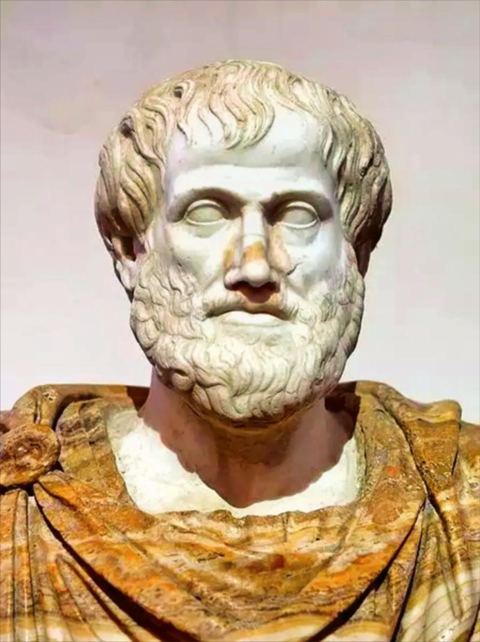

# 亚里士多德

## 亚里士多德：女性是“不完美的男性”

“我们应当把女性的性别看作是一种自然缺陷。” ——《动物产生论》

 “女性就像一个残缺不全的男性。” ——《动物产生论》

“奴隶完全没有思考能力；女性有思考能力，但她的理性缺乏权威（或无约束力）；儿童有思考能力，但发育不全。” ——《政治学》 

“男人的美德在于命令，女人的美德在于服从。” ——《政治学》

“男人的精液带来了生命的‘形式’和‘灵魂’，而女性的身体仅仅提供了‘质料’。因此，在生育中，男性是主动的、完美的创造者，女性则是被动的、物质的接受者。” ——《动物产生论》

“女性之所以是女性，就是因为她缺乏某种能力——她无法像男性那样，利用体温将血液充分精炼成高级的精液。从这个意义上说，女性是由于自然界缺乏热量而导致的非正常发育。” ——《动物产生论》

“自然界在所有动物中都划分了高低：雄性更完美，处于统治地位；雌性较不完美，处于被统治地位。这种法则同样严格适用于人类。” ——《政治学》

“男人的勇敢表现在指挥和命令中，而女人的勇敢则表现在顺从和服从里。正如诗人们所说：‘沉默是女性的最高荣耀。’” ——《政治学》

“女人的理智极其容易受到情感、欲望和外界表象的干扰，因此她的理性在本质上是‘没有权威’的，她无法做出具有最终约束力的道德决断。” ——《政治学》

“在家庭和城邦中，丈夫对妻子的统治是天然且永久的。这种统治类似于政治家对公民的统治，但不同之处在于，妻子永远不可能轮流执政，她必须永远处于被统治的地位。” ——《政治学》

“女性在天性上比男性更残忍、更倾向于嫉妒、更喜欢抱怨，同时也更容易说谎和欺骗；但另一方面，她们也比男性更容易动怜悯之心、更胆小。” ——《动物志》

“两性之间的友谊不可能是一种完全平等的友谊。因为丈夫在德行和地位上都高于妻子，所以丈夫配得上获得更多的尊重，而妻子则应当提供更多的服从。” ——《大伦理学》
