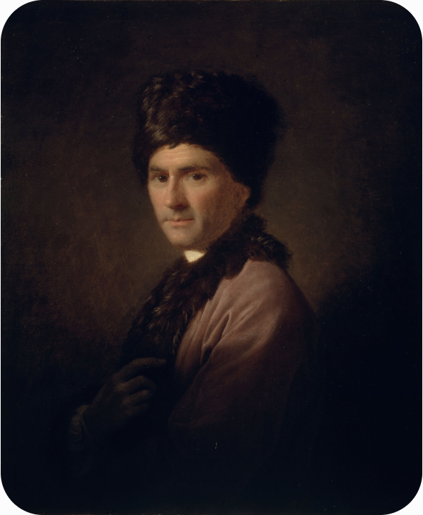

# 卢梭

## 女性教育的唯一目的就是“取悦男人”

“女人的全部一生都应当被约束，都要顺从于最严格、最长期的克制。她必须习惯于顺从，以便在适当的时候能够毫无怨言地忍受丈夫的任性。” ——《爱弥儿》

“女人天生就应该取悦男人并服从男人……如果说女人是为了取悦和听命于男人而生，那么她就应该让自己在男人面前变得可爱，而不是去激怒他；她的力量在于她的魅力。” ——《爱弥儿》

“追求抽象和思辨的真理，以及科学中的原理和公理，这些超出了女性的能力范围。女人的研究应当完全倾向于实践，男人的责任是发现真理，女人的责任是应用真理。” ——《爱弥儿》

“当女人开始讨论权利和法律时，她们通常已经失去了对男人的控制力。她们最强大的武器是眼泪和温柔，而不是逻辑与争辩。” ——《爱弥儿》

“一个有才华、有学者风度的女人，对于她的丈夫、孩子、朋友以及所有人来说，都是一个灾难。由于她居高临下的天才，她蔑视她作为女性的一切义务，并且总是试图把自己变成一个男人。” ——《爱弥儿》

“自然赋予了女人一种极其敏锐的观察力，可以观察到男人的心思，但并没有赋予她们深刻理解这些心思背后原理的智力。” ——《爱弥儿》

“女人的尊严在于默默无闻，她的荣耀在于家人的赞美，她的快乐在于家庭的幸福。一个在公共社交圈、在政论和文学中寻求名声的女人，正在丧失她性别的本色。” ——《新爱洛伊丝》

“两性之间没有也不应该有平等。当女人试图效仿男人，走出家庭去参与公共事务或学术争论时，社会秩序就会开始瓦解，女人也会变得不再像女人。” ——《致达朗贝尔的信》