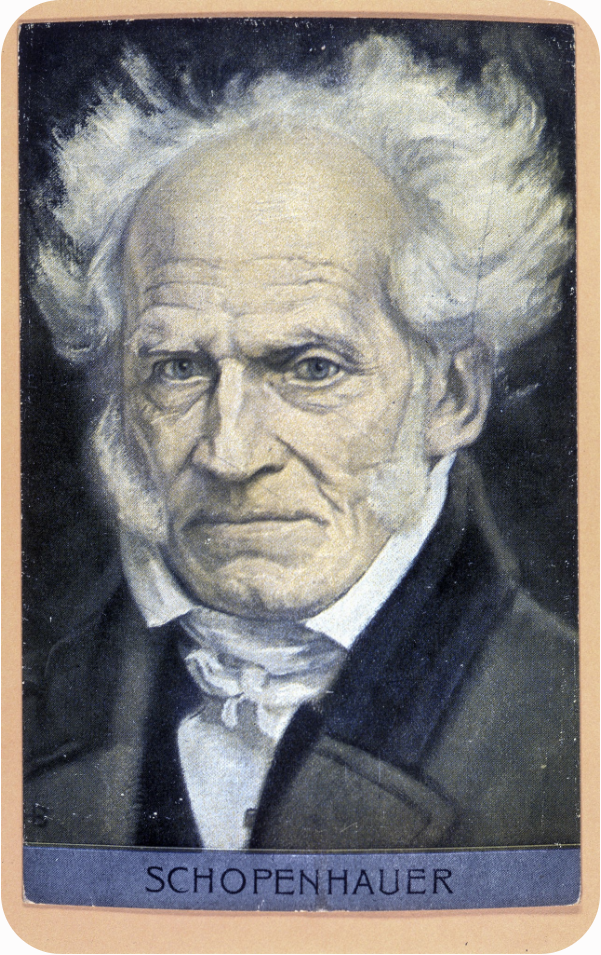

# 叔本华

叔本华属于是那种比较爆的，直言不讳，**哲学界的otto**

## 叔本华：女性是“矮小、窄肩、短腿的下等性别”

“女性只有具备浅薄的理智即可，**她们的智力终其一生都介于儿童和成年男子之间。**” ——《论女性》

“女性天生就是为了服从而存在的……**她们缺乏正义感，也缺乏克制和客观思考的能力**。” ——《论女性》

“只有被性欲迷住心窍的男人，才会把这种**矮小、窄肩、宽臀、短腿的下等性别称为‘美丽’的性别**。” ——《论女性》

“女性最根本的缺陷在于**她们缺乏正义感。这主要是因为她们缺乏理性、无法进行客观的思考，因而总是被眼前的、直观的、感性的事物所完全左右。”** ——《论女性》

“**女性在智力上终其一生都只是个大孩子**。她们只看到事物最接近的一面，只注意当下，把表象当成现实，在最重要的事情上显得比男人更加幼稚。” ——《论女性》

“自然赋予男人的武器是理智与力量，而赋予女性的唯一防卫武器则是顺从与欺骗。因此，**虚伪和欺诈是女性天生的本能**，无论愚笨还是聪明的女人都是如此。” ——《论女性》

“**女性不仅在智力上是低等的，在道德上也是不健全的。她们天生倾向于嫉妒、虚荣、挥霍和背叛**，因为她们缺乏克制自己冲动的理性能力。” ——《论女性》

“在真正的艺术、诗歌和哲学领域，**女性从未创造过任何一件真正伟大、独特和具有持久价值的作品**。她们缺乏真正的审美和客观精神，她们对艺术的爱好纯粹是出于模仿和虚荣。” ——《论女性》

“一夫多妻制在世界大部分地区都是自然的秩序。而欧洲的一夫一妻制赋予了女性不切实际的特权，不仅让男人承受了过重的负担，也让那些无法结婚的‘剩女’沦为了社会的悲剧。” ——《论女性》

“女性不应当拥有独立的财产支配权。**由于她们天生缺乏远见、对未来毫无概念且容易挥霍**，她们的财产应当始终由男性（父亲、丈夫或监护人）来管理。” ——《论女性》

“女性天生就是为了服从而存在的。无论是谁，只要观察一个女人的举止就会发现，**她总是需要一个主子**。如果她年轻，这个主子是情人；如果她老了，这个主子就是神父。” ——《论女性》

**“所谓的女性解放和两性平等，是一种违背自然的荒谬想法**。试图将女性提升到与男人相同的地位，只会破坏社会的根基，并让女性失去她们原本可以通过依附男人而获得的保护。” ——《论女性》

