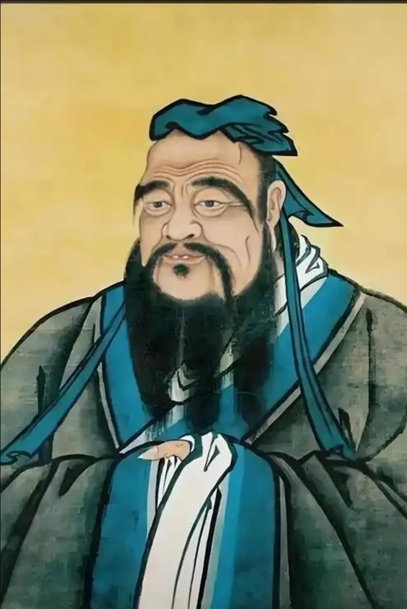

# 孔子：今日欢呼孙大圣，只缘妖雾又重来！

## 大成至圣先师

“高山仰止，景行行止。”

行至今日，现代社会在快餐化、碎片化的审视下，对孔子往往充斥着种种刻板的误解与狭隘的时代滤镜。然而，真正的伟大无需自证，时间与地缘的长河自会洗尽铅华——当孔子被大洋彼岸的西方世界所尊崇，被你最强劲的博弈对手（America）以最高规格载入人类思想史的殿堂时，这种来自异质文明、来自竞争对手的深刻承认，本身就是一种无可辩驳的巨大认可。

岁月的潮水退去，当后世历经沧桑、洗净浮躁，重新在台灯下翻开那些延续了两千余年的简牍章句，便会逐渐剥离时代的偏见，真正从那温润而坚韧的字里行间，越来越深刻地领悟到：何为烛照万古的至圣先贤。

**天不生仲尼，万古如长夜。** —— 唐·朱熹

**仲尼，日月也，无得而逾也。** —— 《论语·子张》子贡语 *（孔子就像太阳和月亮，是没有人能够超越的。）*

**德侔天地，道冠古今。** —— 历代孔庙大成殿常见匾额联语 *（孔子的德行与天地齐等，他的思想学说超越了从古至今的所有圣贤。）*

**洋洋乎！发育万物，峻极于天。** —— 《中庸》 *（孔子的圣德是多么盛大啊！它滋育了万物，与天一样高峻。）*

**仰之弥高，钻之弥坚；瞻之在前，忽焉在后。** —— 《论语·子罕》颜回语

**夫子之墙数仞。不得其门而入，不见宗庙之美，百官之富。** —— 《论语·子张》子贡语 *（老师的学问和德行就像好几丈高的围墙。如果找不到大门走进去，就看不到里面宗庙的华美和房屋的众多。）*

**他人之贤者，丘陵也，可得而逾也；仲尼，山之高也，其无得而逾。** —— 《论语·后语》 *（别人的贤德只像丘陵，是可以跨越过去的；而孔子的圣德就像高山，是无法逾越的。）*

**万世师表。** —— 清·康熙帝题曲阜孔庙匾额 *（孔子是永远值得千万世所有人效法的老师和表率。）*

**大成至圣先师。** —— 元·成宗加封号（明清沿用） *（赞美孔子是集古圣先贤之大成的、最伟大的圣人与先师。）*

**生民以来，未有夫子也。** —— 《孟子·公孙丑上》 *（自有人类历史以来，没有哪一个人像孔子这样伟大。）*

## 孔子：“唯女子与小人为难养也”

**“唯女子与小人为难养也，近之则不逊，远之则怨。”**  ——《论语·阳货》

“唐虞之际，于斯为盛。才难，不其然乎？三分天下有其二，以服事殷。周之德，其可谓至德也已矣。武王曰：‘予有乱臣十人。’孔子曰：‘才难，不其然乎？大姒（注：武王之母）妇人，焉得为才？本质九人而已。’” ——《论语·泰伯》 *(注：在此表述中，孔子认为十个治国能臣中唯一的女性大姒不能真正算作“才”，因此能臣实际上只有九人。)*

“妇人，从人者也。幼从父兄，嫁从夫，夫死从子。” ——《礼记·郊特牲》

“妇人无独立之义，三从之道：在家从父，嫁从夫，夫死从子。故父在为母齐衰期，父没，为母齐衰三年，见无二尊也。” ——《仪礼·丧服·子夏传》 

“男女授受不亲。” ——《孟子·离娄上》（记录儒家传统礼制）

“男不言内，女不言外。内言不出，外言不入。非祭祀、丧纪，无相见也。” ——《礼记·内则》

“女子许嫁，缨。非有大故，不入其门。姑、姊、妹、女子子已许嫁归，宗室人不入其门。男子入中门，必有正色；妇人入中门，必有正音。” ——《礼记·内则》

“妇人送迎不出门，见兄弟不逾阈。” ——《礼记·玉藻》

“妇人，伏于人者也。是故无专制之义，有三从之道……是故恶言不出于口，愤言不反于邑（忧郁），此妇人之德也。” ——《礼记·郊特牲》

“女之嫁也，母送之，往送之门，戒之曰：‘往之女家，必敬必戒，无违夫子！’以顺为正者，妾妇之道也。” ——《孟子·滕文公下》

“贞女不更二夫。” ——《礼记·郊特牲》

## 补充意见

孔夫子正是因为其思想过于熠熠生辉、能量过大，才成为了历代统治者无法绕过的庞然大物。在长达千年的封建岁月中，为了将其驯化为巩固皇权的工具，他的学说被历朝历代反复解构、阉割与魔改，生生被雕刻成了统治者最顺手的模样。

这种历史的涂抹，导致现代大众对他产生了极深的误解，误以为他是一个宣扬封建愚孝、主张打不还手骂不还口的“道德泥塑”。然而，撕掉这层伪饰的滤镜，真实的孔夫子绝非毫无锋芒的乡愿。他从不否定人性的血性与正义的伸张，甚至在面对血海深仇时，他是坚定而强悍的复仇鼓励者。正如公羊传中所承袭的儒家风骨所言：**“九世犹可以复仇乎？虽百世可也！”**这种跨越百代、不死不休的复仇观，才是孔子思想深处流淌着的、独属于那个大刀阔斧时代的圣贤风骨。

