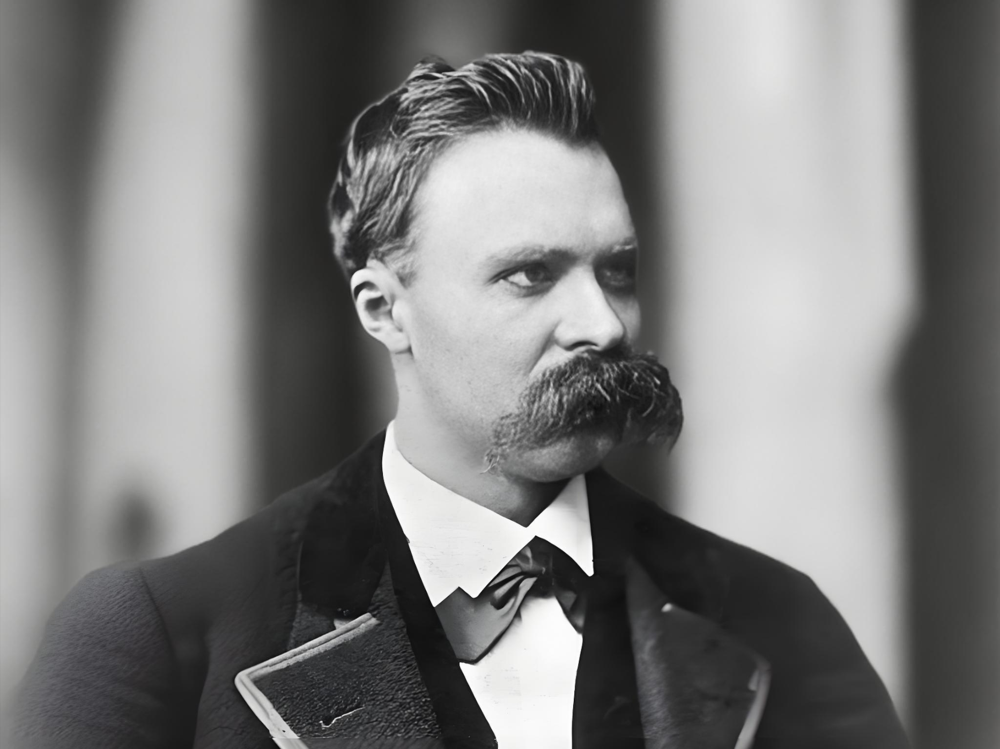

# 尼采

阴阳怪气反串大师

## 尼采：女性是“肤浅而危险的猫科动物”

“你去找女人吗？别忘了带上你的鞭子！” ——《查拉图斯特拉如是说》

“女人的所有一切都是个谜，而女人的所有一切都有一个谜底：那就是怀孕。” ——《查拉图斯特拉如是说》 

“真正的男人需要两种东西：危险和游戏。因此，他需要女人，因为女人是世界上最危险的玩具。” ——《查拉图斯特拉如是说》

“自从来复兴运动以来，女人的权利（实际上是女人的影响力）在减少……当女人向男人索要平权时，她实际上是在退化。” ——《善恶的彼岸》 

“女人一旦有了科学精神，**她的性功能通常就会出问题。**” ——《善恶的彼岸》

“女人最危险的地方在于她的肤浅。男人的深邃在于他的灵魂，而女人的灵魂就像是一层水面，风一吹就会起涟漪，但底下什么都没有。” ——《善恶的彼岸》

“当一个女人追求独立，并开始向人们宣讲她关于‘女人自身’的见解时，这就是她退化的最明确征兆：因为她除了想当一个女学者，还想当一个男学者。” ——《善恶的彼岸》

“女人至今被男人当成鸟类一样对待，这种鸟迷失了方向，飞到了男人的高度；或者是被当成猫，或者是被当成牛。” ——《善恶的彼岸》

**“宣扬女权、争取平权，不过是那些缺乏生育能力、在两性竞争中失败的‘石女’们的无能狂怒，她们试图把所有健康的女性也变成和她们一样平庸的工具。”** ——《善恶的彼岸》

“高雅的男人在思考女人时，应当像东方人思考财产一样：把她看作是可以锁起来的私有财产，看作是天生注定要服从、且在服从中才能达到完美的存在。” ——《善恶的彼岸》

“女人总是在幕后操纵，**她们是所有虚荣、小气、嫉妒和阴谋的源头**。她们缺乏对宏大正义的理解力，**只能看到眼前的利益**。” ——《人性的，太人性的》

“女人的科学和哲学研究，本质上都只是为了取悦男人或者模仿男人。一旦她们失去了‘去爱’和‘去生育’的渴望，她们的理智就会变得枯燥且极具破坏性。” ——《偶像的黄昏》

“男女之间存在着不可调和的深渊和敌对状态。任何试图消除这种敌对、甚至奢谈两性平等的文明，都注定会走向阴柔、退化和灭亡。” ——《善恶的彼岸》

“去同情一个追求平权的女人，就等于去支持一种削弱人类生命力的疾病。**女人的伟大只存在于她作为母亲的牺牲中**，而不是存在于议会或讲台上。” ——《反基督》
