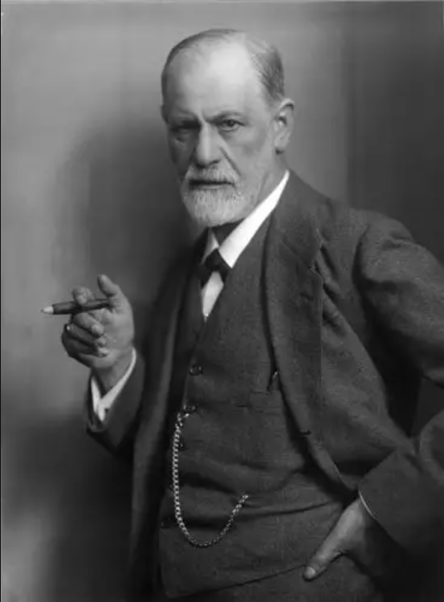

# 弗洛伊德

弗洛伊德觉得都是她们紫色心情链接大脑导致的。

## 弗洛伊德：女性道德和正义感比男性更弱，更容易嫉妒，也更缺乏对客观真理的追求能力

“女性的一生都在受到‘阴茎羡慕（Penis Envy）’的心理驱动。由于在生理上感到自己的缺失，**她们在道德和正义感上表现得比男性更弱，更容易嫉妒，也更缺乏对客观真理的追求能力**。” ——《精神分析引论》

“对女性而言，‘解剖学即命运’。她们的整个心理构造和人格发展，都无法脱离其生理结构的先天缺失。” ——《解剖学与生殖器结构的某些心理后果》（1925）

“由于女性没有经历过男性那样由‘阉割焦虑’带来的强烈压抑，**她们的超我（Superego）永远无法像男性那样坚固和独立。因此，女性在现实生活中往往表现出较弱的正义感，也更容易受到情感和偏见的影响。**” ——《女性特质》（1933）

“女性对‘阴茎羡慕’的普遍心理体验，会转化为根深蒂固的自恋与虚荣**。她们倾向于过度关注自己的外貌，以此来补偿在生理上感受到的先天不足。”** ——《女性特质》（1933）

“嫉妒在女性的心理生活中扮演着比男性更为巨大的角色。**这种嫉妒最初源于童年时期发现自己缺乏男性生殖器时的心理创伤，并最终泛化为对他人一切优势的敌视**。” ——《某些心理后果》（1925）

“当一个女人成功地将对男人的羡慕转化为对孩子的渴望时，她的心理才算达到了成熟；如果她固执于对平权的追求，**那不过是她童年时期未被治愈的‘阴茎羡慕’在成年后的病态延伸。**” ——《女性特质》（1933）

“**女性对人类文明的贡献极为有限。**文明的建立需要极大地压抑和升华原始性冲动，而女性由于其超我的软弱，更容易沉溺于个人的情感与家庭利益，**甚至往往成为阻碍文明宏大进步的保守力量**。” ——《文明及其不满》（1930）

“在三十岁之后，一个男人的心理发展依然充满了可塑性和可能性；而一个同龄的女人，其心理状态往往已经僵化、固定且不可改变，仿佛她已经完成了全部的生命历程，不再接受任何新的智力或精神上的开拓。” ——《女性特质》（1933）

“女性的羞耻心最初并不是一种道德美德，而是一种生物学上的掩饰本能。她们发明纺织和缝纫技术，本质上只是为了编织外物来遮掩自己身体上的‘缺陷’。” ——《女性特质》（1933）