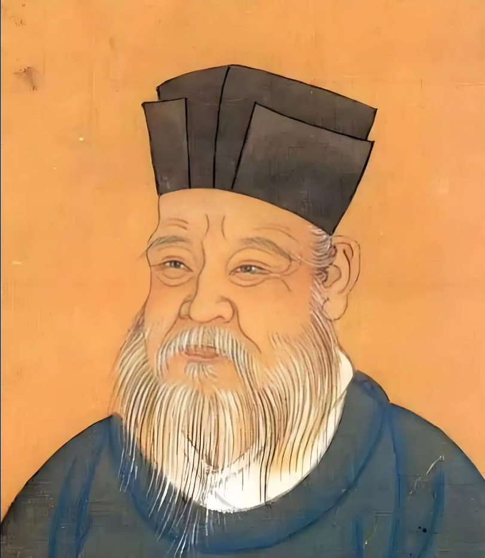

# 朱熹

## 朱熹：“男尊女卑”不仅是家庭秩序，更是宇宙间根本秩序（理）的体现。

**“妇人无外事，以顺为正。内言不出，外言不入，此理之常也。若任其多言，甚至干预家政、朝政，则是阴乘阳位，乃乱之本。”** ——《四书章句集注》 *（注：他强调女性的活动范围只能在家庭内部，必须以顺从为天职。如果让女性多说话、管家事甚至管国事，就是属于“阴”的女性篡夺了属于“阳”的男性的位置，这是天下大乱的根源。）*

**“妇人从人者也。不得自专，凡事当听命于夫。夫死则听命于子，不可有违。”** ——《朱子语类》 *（注：女子一生都是男人的依附者，绝不能有任何独立自主的决定权。活着听丈夫的，丈夫死了听儿子的，没有任何违背的余地。）*

**“男女之别，国之大本。男正位乎外，女正位乎内。男刚女柔，主天法地，此不可易之理。”** ——《朱子语类》

**“虽是饿死，事极小；失节，事极大！”** ——《朱子语类·卷十三》 *（注：这是理学中最著名的语句之一。）

**“妇人贞洁，从一而终。有夫之妇，心无他适，虽遭大难，宁死不辱，此乃妇道之大节。”** ——《朱子书信集》

**“妇人智虑短浅，易流于私情，难与共国家之大计。古之明王，必深闭固拒于女谒（后妃求情干政），防微杜渐，不使之有纤毫干预之渐。”** ——《朱子语类》 *（注：他认为女性的智慧和眼界天然短浅，容易陷于私人情感，绝对不能让她们参与国家大计。英明的君主必须严厉拒绝女性的干政。）*

**“天下之乱，多由内宠（女色）始。女色之惑人，能消磨男子之刚刚之气，使之沉溺于私欲而忘大义，可不惧哉！”** ——《周易本义》