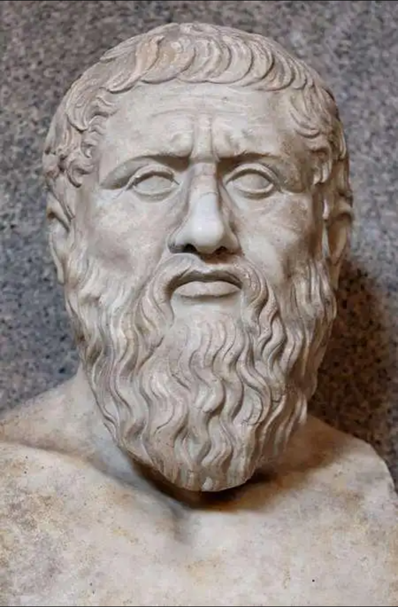

# 柏拉图

## 柏拉图：女性更倾向于隐蔽和狡诈

“在管理城邦的事务上，没有一件事是专门属于女人的，也没有一件事是专门属于男人的。然而，两性之间存在着天然的资质差异：女人的能力在一切事情上都比男人要弱。” ——《理想国》第五卷

“如果我们要让女人承担和男人一样的职责，我们就必须给它们一样的教育。但我们必须承认，在所有这些事情上，女性作为一个个体，其表现都无法与男性并提，她们是天然的弱者。” ——《理想国》第五卷

“一个由女人来管理家务或支配男人的社会，是违背自然秩序的。女人天然缺乏宏观的视野和对正义的理解力，她们更容易陷入对眼前私利的计较中。” ——《理想国》第五卷

“在所有的生物中，**女性更倾向于隐蔽和狡诈**，因为她们生来就比男性弱小。由于这种天生的软弱，她们更难管束，也更容易在缺乏严密法律制约时堕落。” ——《法律篇》第六卷

“把女人和儿童、奴隶划归一类是理所当然的，因为他们都缺乏高尚的理性，更容易被肉体的欲望、恐惧以及情绪的波动所支配。” ——《法律篇》第七卷

“平庸的男人才会被女人的身体所吸引，他们的爱仅仅停留在繁衍后代的动物本能上；而高尚的男人则追求同性（男性）之间的灵魂契合，**因为只有男性的灵魂才具备追求神圣智慧和真理的潜力**。” ——《会饮篇》

“神在最初创造人类时，只创造了完美的男性灵魂。那些在尘世中未能战胜恐惧和欲望、活得自私而胆怯的男性，死后在转世时就会降级沦为女人。” ——《蒂迈欧篇》

“女性的子宫本质上是一个渴望生育后代的动物。当它长期得不到受孕的机会时，就会在体内四处游走，阻塞呼吸道，导致女性陷入歇斯底里的疯狂与疾病之中。” ——《蒂迈欧篇》

“一个男人如果活得胆小或不公正，他在转世时就会变成一个女人。因此，女人的存在本身就是对一种不完美灵魂的惩罚。” ——《蒂迈欧篇》

“在所有的技能和追求上，女人的天性都比男人要弱，尽管在某些具体的事务上某些女人可能胜过某些男人，但总体而言，女性是弱于男性的性别。” ——《理想国》