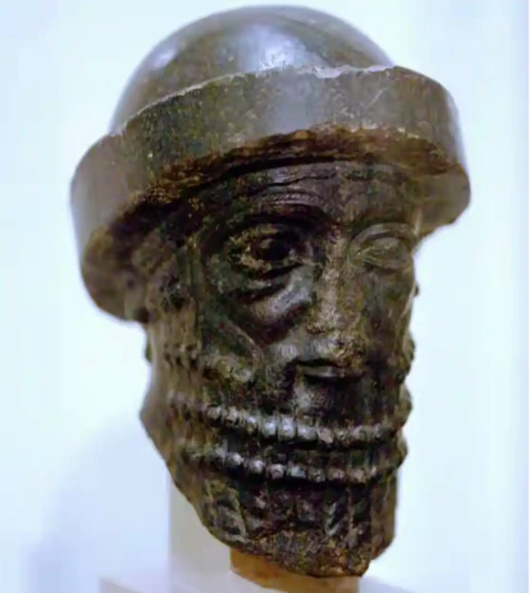

# 汉谟拉比

汉谟拉比（英语：Hammurabi，约前1810年—约前1750年），是阿摩利人建立的古巴比伦王国第六任君主，公元前1792年继位，在之后在一系列战争中击败邻国，将巴比伦的统治区域扩展至整个美索不达米亚。从而开创了强盛的巴比伦帝国，在位期间使王国达到全盛。

## 汉谟拉比：荡妇应当被投入水中淹死

“如果一个妇人蔑视其丈夫，并说‘你不能占有我’，那么应当对她的背景进行调查。**如果她行为不检、抛弃家庭并贬低丈夫，该妇人应当被投入水中淹死。**” ——《汉谟拉比法典》第143条

**“如果一个男人娶妻，但未曾与其订立契约，则该妇人非其妻。”** ——《汉谟拉比法典》第128条

**“如果一个男人的妻子被发现与另一个男人同床共枕，人们应当将他们捆绑起来，一同投入水中淹死。但如果该妇人的丈夫饶恕了他的妻子，那么国王也可以饶恕他的臣仆。”** ——《汉谟拉比法典》第129条 

**“如果一个男人的妻子因另一个男人的缘故，导致其丈夫被杀害，人们应当将该妇人钉在尖桩上处死。”** ——《汉谟拉比法典》第153条

**“如果一个妇人败坏家产、轻视丈夫，并说：‘你不能占有我’，（经调查）如果她曾外出且行为不检、挥霍无度、贬低丈夫，则该妇人应被投入水中；而她的丈夫可以休了她，且无需给她任何补偿或回门费。”** ——《汉谟拉比法典》第141/143条