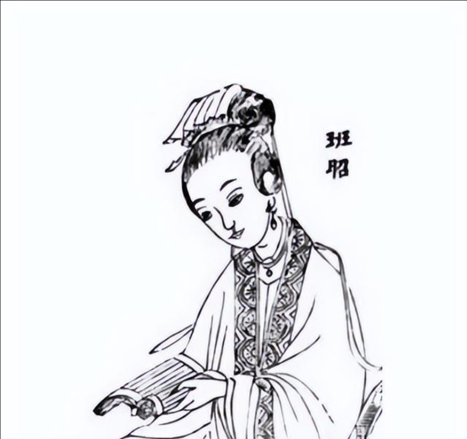

# 班昭

班昭（又称曹大家）作为中国古代极具才华的女历史学家**（是的，她是女的，这下GHG了；不对，还可以被开除女籍，她还可以是长发男）**、文学家，其晚年撰写的《女诫》是中国历史上第一部系统规训女性行为准则的著作。班昭认为，**认为女性从出生那一刻起就应当习惯处于最底层。**

## 班昭：女性应该习惯处于最底层

**“古者生女三日，卧之床下，弄之瓦塼，而斋告先君。卧之床下，明其卑弱，主下人也。”** ——《女诫·卑弱》 *（注：古代生下女孩三天后，要让她睡在床底下，给她玩弄纺线用的砖瓦，并祭告祖先。让她睡在床下，是为了向她表明女性天生卑微软弱，一生都应当居于人下、服侍他人。）*

**“卑弱下人，退让嫌微；卑不辟羞，辱敢耻焉；忍辱含垢，常若畏惧，是谓卑弱下人也。”** ——《女诫·卑弱》 *（注：女性应当凡事退让，避开嫌疑；面对羞辱不该躲避，更不敢觉得耻辱；要能够忍辱负重、含垢忍痛，随时表现出恐惧和敬畏的样子，这就叫做甘居人下。）*

**“夫有再娶之义，妇无二适之文。故曰夫者天也。天固不可逃，夫固不可离也。”** ——《女诫·专心》 *（注：男人有再娶的权利和道理，但女人在礼制上绝对没有改嫁的条文。所以说丈夫就是妻子的天。天是无法逃离的，丈夫也是绝对不能离开的。）*

**“行违神祇，天则罚之；礼义有愆，夫则薄之。唯此二者，固且惧。况于舅姑（公婆）之命，其可违哉！”** ——《女诫·曲从》

**“物有顺逆，事有是非。大人（公婆）虽非，言犹当顺；大姊（大姑子）虽恶，义犹当服。况乎夫主之有言，何得而有违！”** ——《女诫·曲从》 *（注：世事虽然有对错是非之分，但哪怕公婆和大姑子做错了、说错了，做媳妇的也必须顺从和服从，更何况是丈夫的话，怎么能够有任何违背呢！）*

**“择其言语，不道恶言，时然后言，不厌于人，是谓妇言。盥浣尘秽，服饰鲜洁，沐浴以时，身不垢辱，是谓妇容。专心纺绩，不好戏笑，洁齐酒食，以奉宾客，是谓妇功。”** ——《女诫·妇行》 *（注：她将女性的价值完全框定在：说话不刻薄（妇言）、按时洗澡洗衣保持干净（妇容）、专心纺纱织布并做好饭菜侍奉宾客（妇功）这三件事上。）*

**“修身正己，妇人最难。难在不妒，妒则行恶。夫若有纳妾之意，当欣然助之，切不可面露愠色，此乃妇德之大者。”** ——《女诫·和妹》（后世对女诫精神的引申与实践指南）

**“夫不御妇，则威严废；妇不事夫，则义理堕。这两者其实是一样的。但现在的男人只知道管教妻子，却不知道女子的教育比男人更需要规训。”** ——《女诫·敬慎》（大意） *（注：她主张女性必须接受教育，但她提倡女子教育的目的**绝不是为了开启民智或培养独立人格**，而是为了让女性更好地理解礼教，从而更自觉、更高效地服侍丈夫和婆家。）*

**“阴阳殊性，男女异行。阳以刚为德，阴以柔为用；男以强为贵，女以弱为美。”** ——《女诫》

**“妇德不必才明绝异，妇言不必辩口利辞……物有刚柔，用有先后，生有上下，此天地之常经，人伦之大体也。”** ——《女诫》