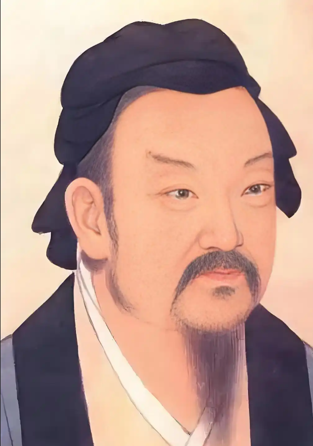

# 董仲舒

## 董仲舒：男尊女卑，天道也

**“天为阳，地为阴；阳为主，阴为助……丈夫虽贱，皆为阳；妇人虽贵，皆为阴。”** ——《春秋繁露·顺命》 *（注：他明确指出，哪怕男人的社会地位再卑贱，他也属于高贵的“阳”；哪怕女人的身份再高贵，她也属于卑贱的“阴”。在性别秩序面前，阶级都要让位。）*

**“阳尊而阴卑，天之制也。丈夫生而愿为之有室，女子生而愿为之有家，皆导于天理而顺于人情也。”** ——《春秋繁露·基义》 *（注：直接定义“阳尊阴卑”是上天制定的绝对规则，女人的宿命就是出嫁、依附于男人，这是天理。）*

**“阳始出物，阴始入物；阳方生育，阴方杀伤。是故天之志，常在生育而厌杀伤，常在阳而厌阴也。”** ——《春秋繁露·阳尊阴卑》 *（注：“阳”等同于生命和生养，“阴”等同于毁灭和杀伤，上天的意志是喜爱阳、厌恶阴，代表女性的“阴”本身就被上天所厌恶。）*

**“妻者，夫之合也。阴道无专，必由于阳，故妻无专制，必由于夫。”** ——《春秋繁露·基义》 *（注：妻子只是丈夫的配合者。属于“阴”的女性绝不能有任何自作主张的权力，一切行动和意志必须由属于“阳”的丈夫来决定和引导。）*

**“君臣、父子、夫妇之义，皆取诸阴阳之道。君为阳，臣为阴；父为阳，子为阴；夫为阳，妻为阴……物莫不孤立，独阳不生，独阴不成，皆有对待。阳者，德也；阴者，刑也。”** ——《春秋繁露·基义》 

**“国家将有失道之败，而天乃先出灾害以谴告之……妇人干政，阴气太盛，则水旱不时，此天之明诫也。”** ——《春秋繁露·必仁且智》 *（注：如果允许女性参与政治，就会导致阴气泛滥，上天就会降下水灾、旱灾或反常的气候来作为警告。）*

**“内宠盛而外怨多，妇言用而大义废，此阴乘阳、下凌上之异也，国必流血。”** ——《春秋繁露·微法》 *（注：他极力反对君王宠幸和听信后妃，认为“听信妇人之言”会导致国家大义被废黜，这种“阴气压倒阳气”的反常现象，必然会给国家带来流血之灾。）*

