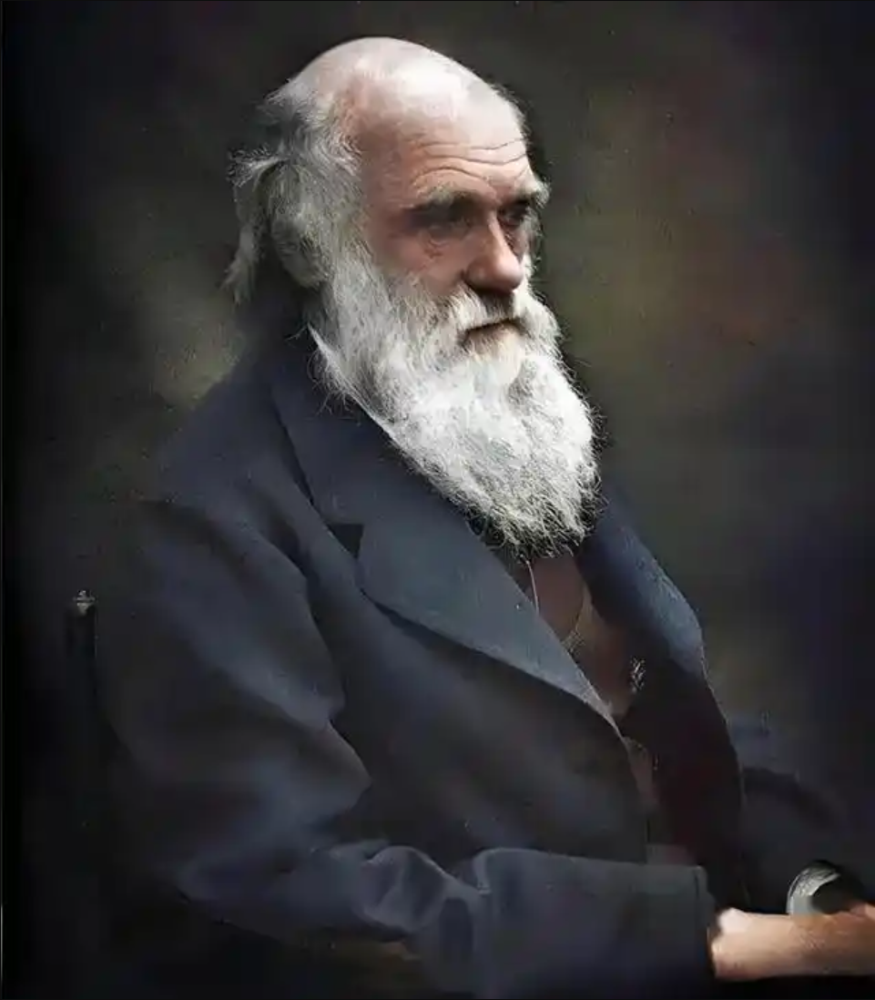

# 达尔文

## 达尔文：**男人在智力上领先女人的绝对优势在生物学上将永远保持下去**

“无论在进行深邃思考、逻辑推理，还是在运用想象力与感官、双手的技巧上，男人所能达到的高度都是女人无法企及的。如果将两性在艺术、科学、哲学和文学等所有领域的最高成就进行对比，**男人的平均能力显然高出女人一大截**。” ——《人类的由来》第十九章

“男人的智力优势和强壮体魄，是在漫长的原始进化中通过‘性选择’（Sexual Selection）沉淀下来的。为了争夺配偶、为了在残酷的生存斗争中保护家庭，**雄性必须不断发展竞争心、果敢和高智商，而这些特质通过遗传，让成年男性变得比女性更为优秀。**” ——《人类的由来》第十九章

“正如公鸡比母鸡拥有更华丽的羽毛和更锋利的距，人类的雄性在进化的长河中也获得了更强大的大脑。试图在社会分工上完全抹平两性的差异，就是违背了自然选择留下的生物学规律。” ——《人类的由来》第十九章

“女性在情绪特质上表现出更多的温柔和更少的自私，这与她们的母职密切相关。然而，这些特质也让她们在面对复杂的抽象问题时，更容易受到直觉和模仿天性的限制，缺乏男人那种打破常规的原创性思维。” ——《人类的由来》第十九章

“即使女性通过长期的、平等的严苛教育在智力上获得了提升，她们也必须把这种高度进化的智力在成年期遗传给女儿的同时，也同等地遗传给儿子。因此，由于两性协同遗传的规律，**男人在智力上领先女人的绝对优势在生物学上将永远保持下去**。” ——《人类的由来》第十九章

“在人类社会的进化过程中，**男人作为抚养者和开拓者，承担了主要的生存压力（这句话含金量非常之高）。**这种长期的自然选择结果，导致男人的大脑在分析、归纳以及克服困难方面，演化出了比女性更为坚韧和深邃的结构。” ——《人类的由来》第二十一卷

